# Smalidea

23/3/24 by Xin Xiong

## Environment preparation

Smalidea is a plugin for  [IntelliJ IDEA](https://www.jetbrains.com/idea/)/[Android Studio](http://developer.android.com/sdk/index.html), see https://github.com/JesusFreke/smalidea for details. 

According to the README.md, you should follow steps below to install it as plugin .

### Download

Download `smalidea-*.zip` from https://bitbucket.org/JesusFreke/smalidea/downloads. 

Note: Do not unzip it, otherwise you may have to zip it again to install it. 

### Install

Go to **Setting** **→** **Plugins** **→** **Install plugin from disk** , then select `smalidea-*.zip`.  Then click **apply**.

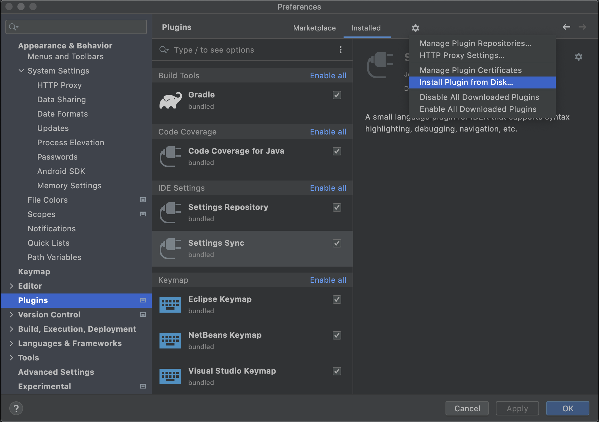

### Done!

## Task 0: Debug to acquire the hidden result

### Task specification

Simple Encryption is an app that can encode or decode using caesar cipher. Caesar ciphers use a substitution method where letters in the alphabet are shifted by some fixed number of spaces to yield an encoding alphabet. 

There's two input box in the app, message and the key, and key should be all numbers. For any key except `666`, you'll see the encryption or decryption result in hex form at once. The task for you here is to**get both encryption and decryption result when message is "pore" and key is 666**.

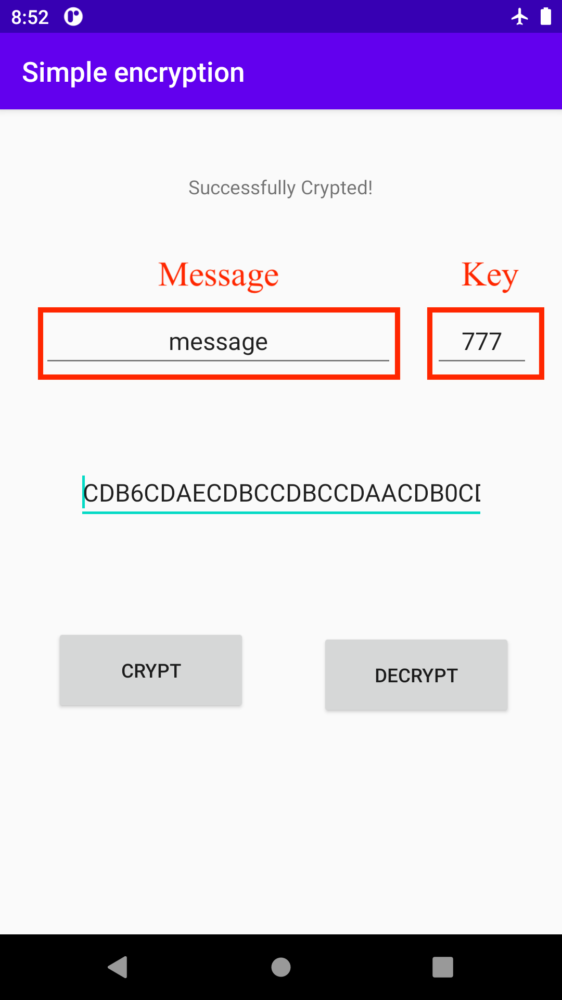

In this task, you don't need to figure out how caesar cipher works. With Smalidea , you can debug the given apk to *"steal"* the result instead! 

### Steps

In a nut, you have to convert apk to smali files first. Then, set breakpoint and debug to see the runtime value.

#### Decompile to set up a breakpoint

In mainactivity, we can see that both "CRYPT" and "DECRYPT" button are binded with a corresponding listening function. Take encryption as example:

```java
        btn.setOnClickListener(new View.OnClickListener() {
            @Override  // android.view.View$OnClickListener
            public void onClick(View v) {
                try {
                    int v = Integer.parseInt(et2.getText().toString());
                    if(v == 666) {
                        tv.setText("");
                        String s = et.getText().toString();
                        byte[] arr_b = MainActivity.this.Encrypt(s, v).getBytes();
                        MainActivity.this.BytePrintAsString(arr_b);
                        textView.setText("Successfully Crypted!");
                        return;
                    }

                    String s1 = et.getText().toString();
                    byte[] arr_b1 = MainActivity.this.Encrypt(s1, v).getBytes();
                    String s2 = MainActivity.this.BytePrintAsString(arr_b1);
                    tv.setText(s2);
                    textView.setText("Successfully Crypted!");
                }
                catch(Exception e) {
                    textView.setText(e.getMessage());
                    String s3 = textView.getText().toString().concat("\nTry To Put Only Numbers in Key");
                    textView.setText(s3);
                }
            }
        });
```

As mentioned above, the apk show the result if `key`(`v`) is not 666. Therefore, we can set the breakpoint to the instruction performing `MainActivity.this.BytePrintAsString(arr_b);` in the `if(v == 666) ` branch. 

And the `BytePrintAsString()` looks like:

```java
    String BytePrintAsString(byte[] byteArray) {
        String res = "";
        int i;
        for(i = 0; i < byteArray.length; ++i) {
            String s1 = Integer.toHexString(byteArray[i] & 0xFF);
            if(s1.length() == 1) {
                s1 = '0' + s1;
            }

            res = res + s1.toUpperCase();
        }

        return res;
    }
```


#### Disassemble apk to smali

There are many ways to disassemble apk into smali.

##### [Baksmali](https://github.com/JesusFreke/smali)

Baksmali is an assembler/disassembler for the dex format used by dalvik, Android's Java VM implementation. The syntax is loosely based on Jasmin's/dedexer's syntax, and supports the full functionality of the dex format (annotations, debug info, line info, etc.) 

You can run below command to disassemble

```
 java -jar /your/path/to/baksmali-*.*.*.jar disassemble ${apk} -o ${targetdir}
```

##### [apktool](https://github.com/iBotPeaches/Apktool)

apktool is a tool for reverse engineering 3rd party, closed, binary Android apps. It can decode resources to nearly original form and rebuild them after making some modifications; it makes possible to debug smali code step by step. Also it makes working with app easier because of project-like files structure and automation of some repetitive tasks like building apk, etc. (It will call Baksmali)

You can run below command to disassemble:

```
/your/path/to/apktool d ${apk}
```

##### android studio

Recent version of Android studio can analyze and disassemble apk. Refer to [below](#Load apk into android studio).

#### Debuggable=true?

To debug smoothly using the recent version Android Studio with Smalidea, we need to gurantee `android:debuggable="true"` in the AndroidManifest.xml. 

In this app, TA has already added it for you. If you encounter this problem in your debugging journey, you can follow the pseudo step below:

1. add `android:debuggable="true"` in the correct place in AndroidManifest.xml
2. Reassemble it to apk `apktool d`
3. Sign the apk (e.g. `apksigner` in SDK build-tools ), otherwise it would be rejected by the device

#### Load apk into android studio

First, select **Profile or Debug APK** from the startup page, then select the apk.

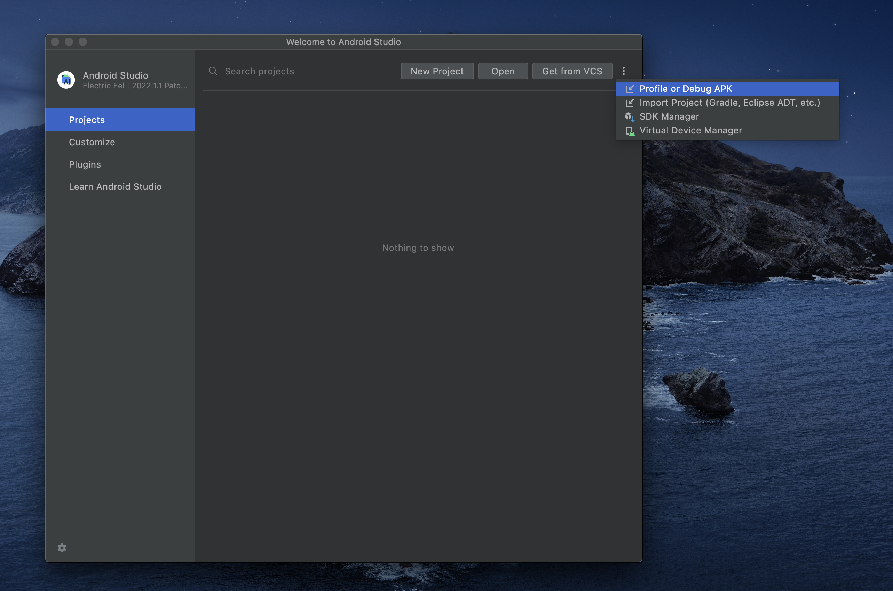

Then, the workplace would show up.

#### Set the breakpoint

Let's set the breakpoint to the instruction found [previously](#Decompile to set up a breakpoint).

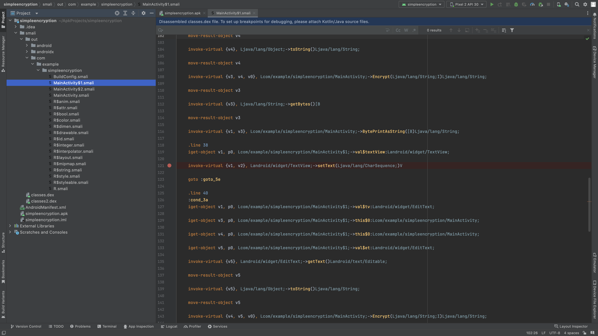

Don't forget to check your run/debug configuration.

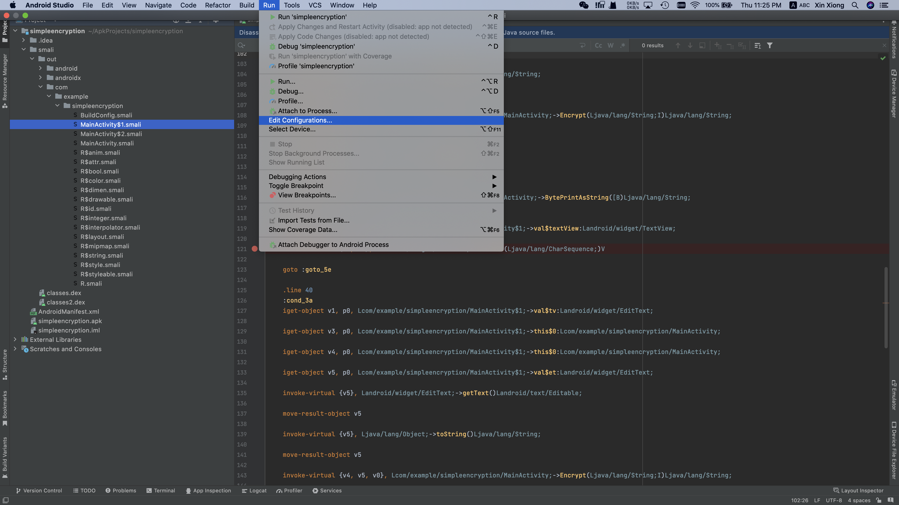

You should have a Configuration like this natively if nothing goes wrong.

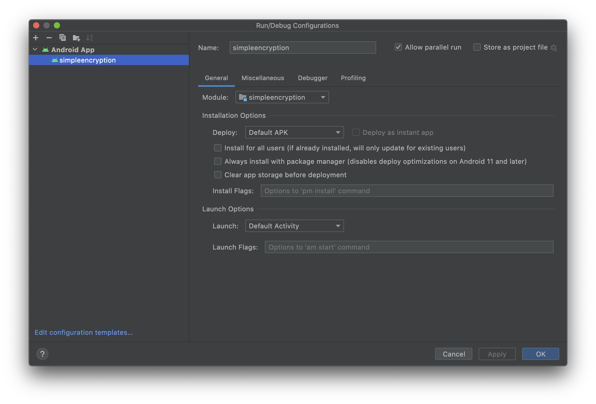

#### Debug!

Press `ctrl+D` or go to**Run -> Debug** from the top row to launch the debugging window. The app would launch.

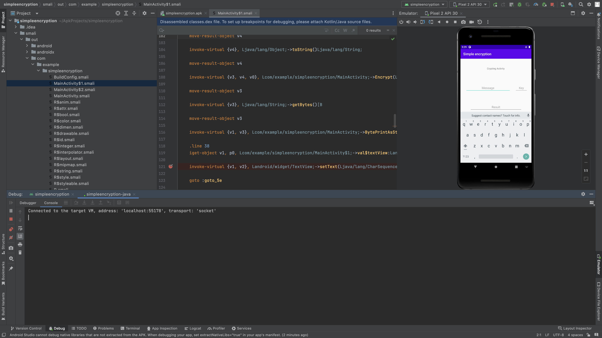

Set the message to pore and key to 666, and click CRYPT for example.

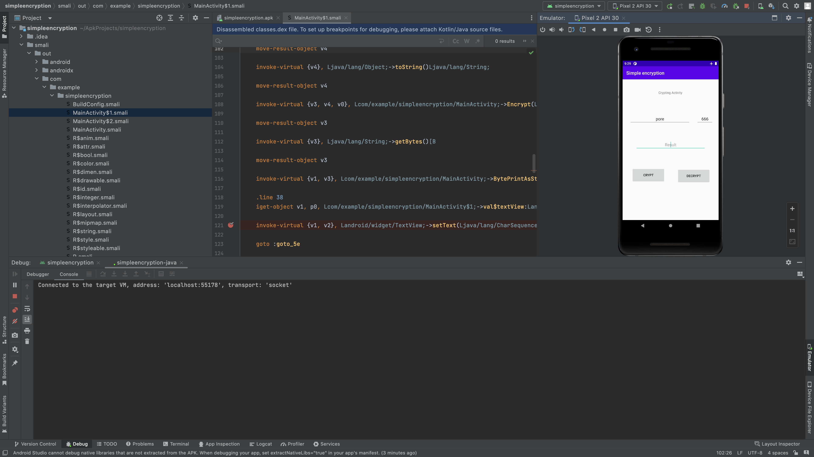

Here we go! The program stops at the desired location.

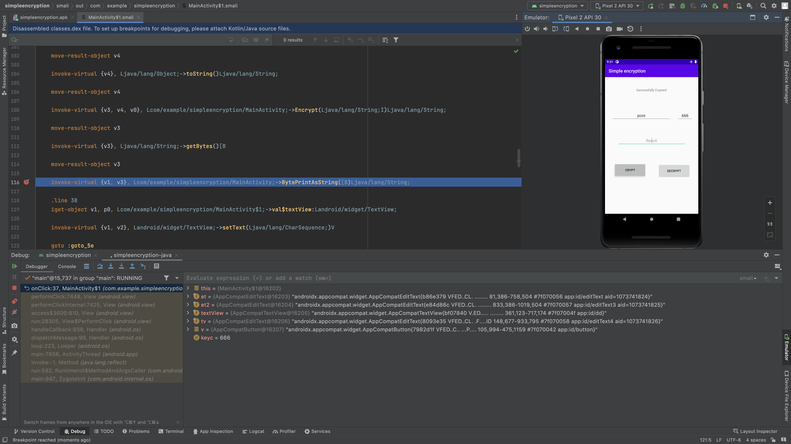

Let's step into `BytePrintAsString()`,  with f7.

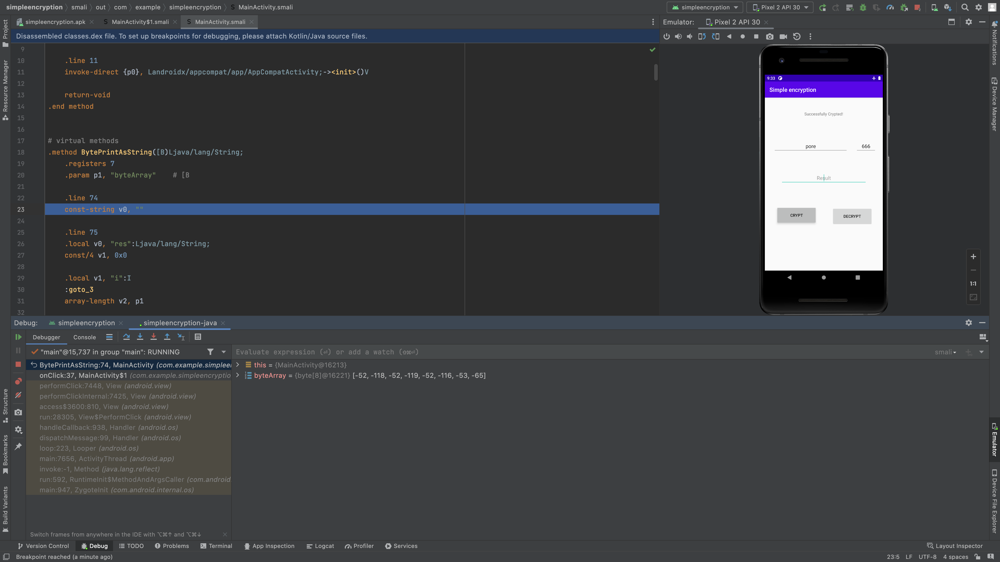

Remember the decompilation result of `BytePrintAsString()`, we only need to know the result. So we set the breakpoint at the end of the function. 

Then, boooom!

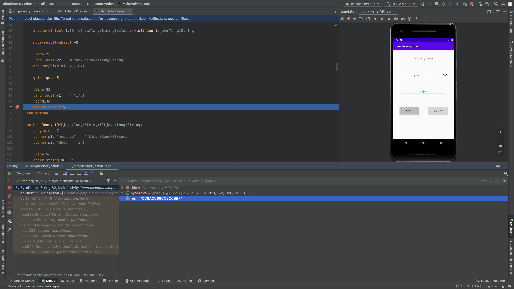

We made it!

#### Correct answer

Here are the correct answer of this task, you can practice with decryption if you like ~

For encryption, the answer should be CC8ACC89CC8CCBBF

For decryption, the answer should be EFB796EFB795EFB798EFB78B

## Enjoy debugging
