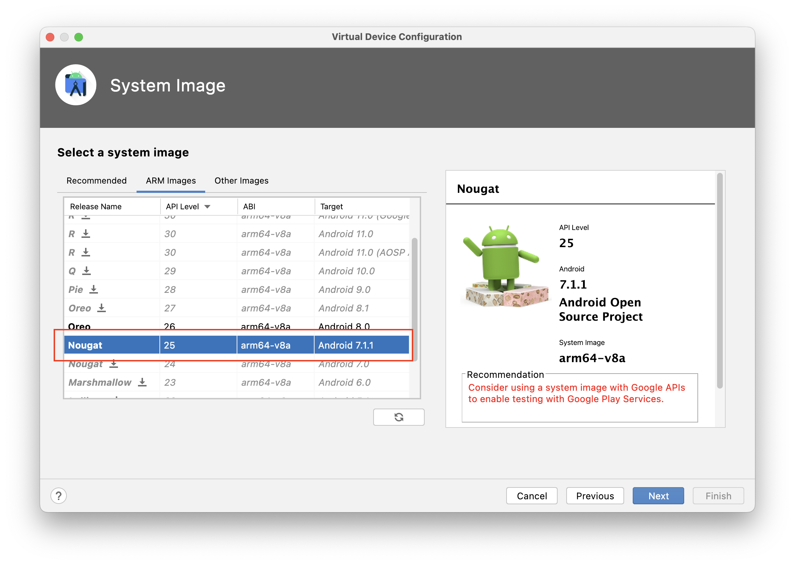
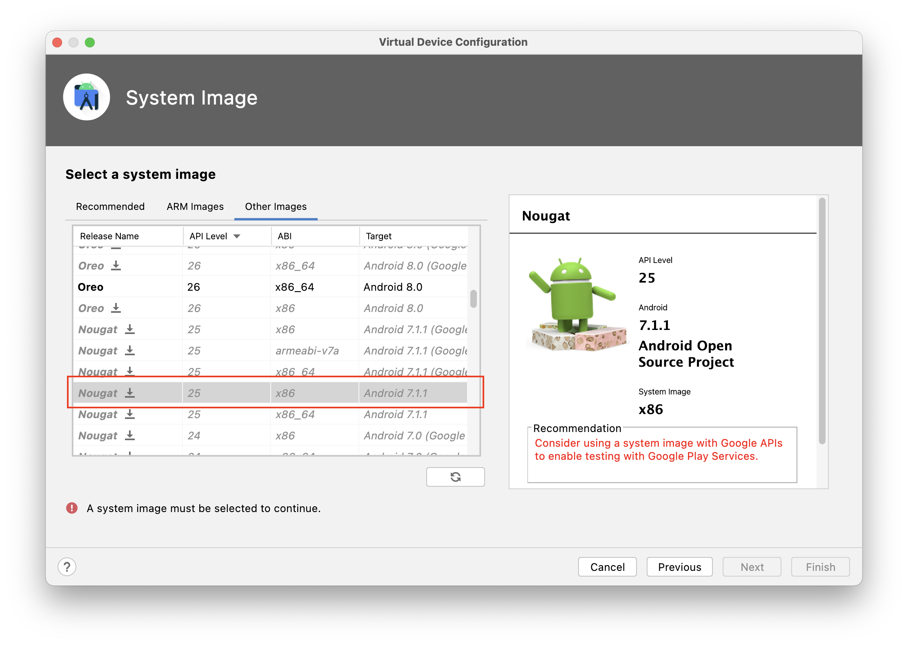
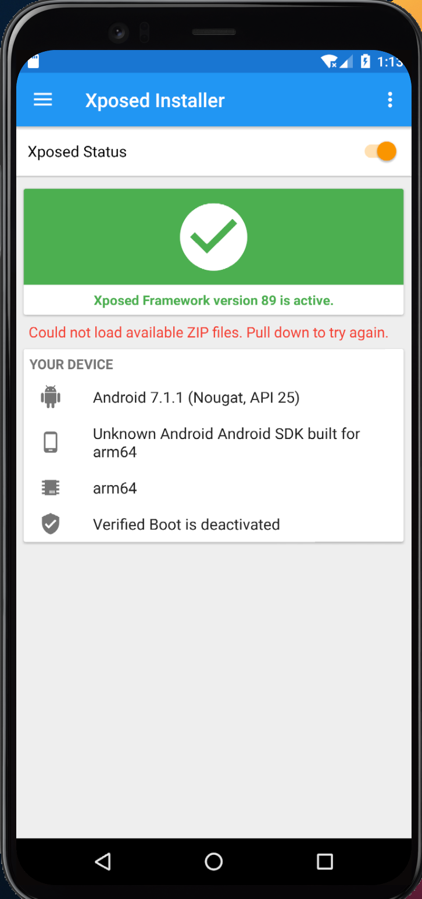
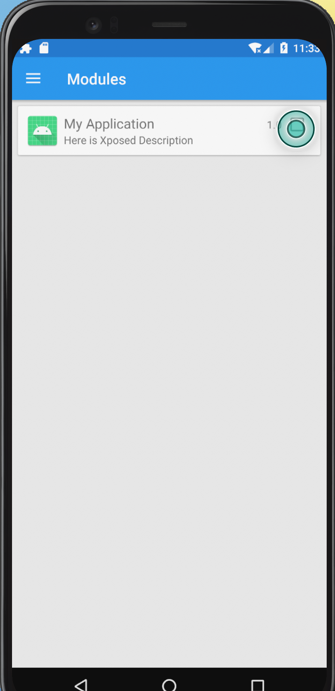
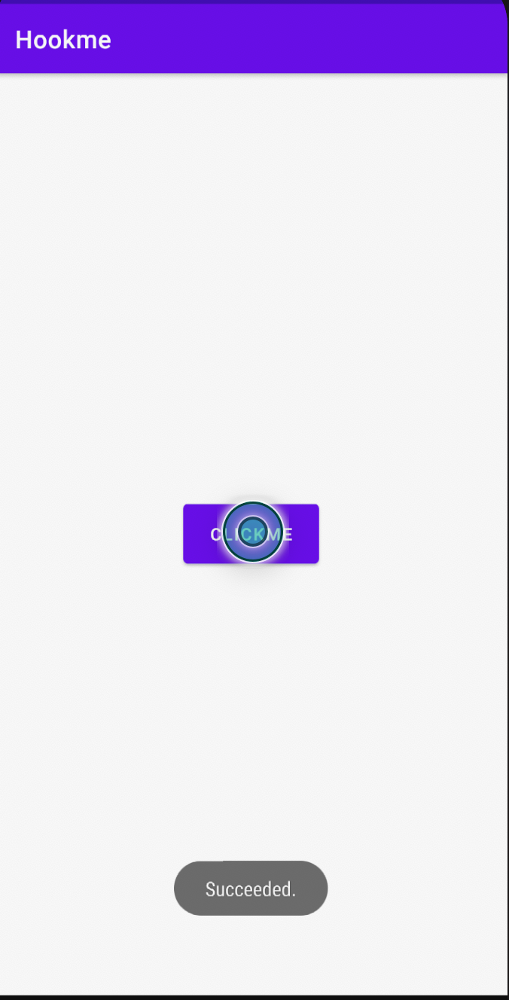
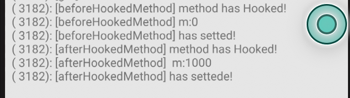

# Xposed_task

## Task 0 : Xposed Installaton

### Step 1 Android studio emulator install

Please select the following system image.

- **For Arm/Arm64**：

  - Nougat, Android API 25, arm64-v8a, Android 7.1.1 [**not** Google Image]

    

- **For x86/x86-64**:

  - Nougat, Android API 25, x86, Android 7.1.1 [**not** Google Image]

  

**!!!DO NOT** open your emulator immediately.

### Step 2 Install Xposed

Get the following things:

- Xposedinstaller.apk : [xposedinstaller](https://forum.xda-developers.com/showthread.php?t=3034811)
- xposed-**.zip :[xposed zip](https://ia802803.us.archive.org/33/items/xposed-sdk25/)

Then please follow **these tutorial** to install ：[xposed install tutorial](https://forum.xda-developers.com/t/guide-how-to-install-xposed-on-the-official-android-emulator.4472137/?__cf_chl_tk=JqOgMocMhCb06XeSA0FICg.gQV_dlLXhSJnNeEbgygc-1679540887-0-gaNycGzNCRA)

You may encounter the following errors when running the script:

- Case 1

  ```shell
  mv: bad '/system/bin/app_process32': No such file or directory
  ```

  Solution:

  ```shell
  ln -s app_process32_xposed  app_process32
  ```

- Case 2

  ```shell
  touch: '/system/lib/libart.so.no_orig': No such file or directory
  ```

  Solution:

  ```shell
  mkdir /system/lib
  ```

- Case 3

  ```shell
  XposedInstaller.apk not found
  ```

  Install the app before run the script, please try again.

  

Check your if install **successfully**




## Task 1: 

In this task, we will provide your an example `hookme.apk`. You need to hook the `onClickMe` method to force the app to print "Succeeded". This task is simple and we will provide step-by-step tutorials.

#### Step1: Develop a xposed module project

Please follow the slides p19-24 to finish the setup

#### Step2: Get and launch hookme.apk

Please see the MainActivity code of the apk. If you want to print "Succeeded.", you need to make `this.m == 0`. This can be done by hook the `onClickMe`.

```java
public class MainActivity extends AppCompatActivity {
    Button clickMeButton;
    int m;
    @Override
    protected void onCreate(Bundle savedInstanceState) {
        super.onCreate(savedInstanceState);
        setContentView(R.layout.activity_main);

        m = 1000;

        clickMeButton = (Button) findViewById(R.id.clickMeButton);

    }

    public void onClickMe(View v){
        if (this.m == 1000) {
            Toast.makeText(this, "Failed.", Toast.LENGTH_LONG).show();
        }
        if (this.m == 0) {
            Toast.makeText(this, "Succeeded.", Toast.LENGTH_LONG).show();
        }
    }
}
```

Install and launch hookme.apk:

```bash
adb install hookme.apk
adb shell am start -n com.example.hookme/.MainActivity
```

Then the app will be launched. If you click the button it should always print "Failed." 

#### Step3: Try to hook the function

Creat a new class in `src/main/` ,for example `HookTest.jave` . Here is the module code:

```java
package com.example.myapplication;

import android.os.Bundle;
import android.util.Log;

import java.lang.reflect.Field;
import java.lang.reflect.Method;


import de.robv.android.xposed.IXposedHookLoadPackage;
import de.robv.android.xposed.XC_MethodHook;
import de.robv.android.xposed.XposedBridge;
import de.robv.android.xposed.XposedHelpers;
import de.robv.android.xposed.callbacks.XC_LoadPackage;

public class HookTest  implements IXposedHookLoadPackage {

    @Override
    public void handleLoadPackage(XC_LoadPackage.LoadPackageParam loadPackageParam) throws Throwable {
       //首先定位package
        if (loadPackageParam.packageName.equals("com.example.hookme")) {
           //关键一步，获取Class对象
            Class c = loadPackageParam.classLoader.loadClass("com.example.hookme.MainActivity");
            //尝试hook onCreate
            XposedHelpers.findAndHookMethod(c, "onCreate", Bundle.class, new XC_MethodHook() {
              	//注意beforeHookedMethod和afterHookedMethod的区别
                @Override
                protected void beforeHookedMethod(MethodHookParam param) throws Throwable {
                  	//查看是否获取成功
                    XposedBridge.log("[beforeHookedMethod] method has Hooked!");
                    super.beforeHookedMethod(param);
                    //先获取需要修改的值
                    int x = XposedHelpers.getIntField(param.thisObject, "m");
                    XposedBridge.log("[beforeHookedMethod] m:" + x);
                  	//设置为所需要的值
                    XposedHelpers.setIntField(param.thisObject, "m", 0);
                    XposedBridge.log("[beforeHookedMethod] has setted!");

                }

                @Override
                protected void afterHookedMethod(MethodHookParam param) throws Throwable {
                    super.afterHookedMethod(param);
                  	//查看是否获取成功
                    XposedBridge.log("[afterHookedMethod] method has Hooked!");
                    super.beforeHookedMethod(param);
                    //先获取需要修改的值
                    int x = XposedHelpers.getIntField(param.thisObject, "m");
                    XposedBridge.log("[afterHookedMethod]  m:" + x);
                    //设置为所需要的值
                    XposedHelpers.setIntField(param.thisObject, "m", 0);
                    XposedBridge.log("[afterHookedMethod] has settede!");
                }
            });
        }
    }

}
```

#### Step 4: Install the module

- build project and install the app

- open `xposed_installer` app, then you will see the module, check box to enable the module

  

- reboot emulator to activate module (!!Note: use **`adb reboot`** to reboot emulator, not use shutdown button)

- now open the hookme app, click the button and you will see the change.

  

If you fail, you can check the log in `xposed_installer` app

If you success, please check the log and think the difference between `beforeHookedMethod` and `afterHookedMethod`



## Task2 (optional)

You can do some free trials on `hookme.apk` and think the other solutions.

Also you can see the last slides in `L5.1-Virtualxposed` and try to find some interesting tasks to do in PJ1.


Enjoy!